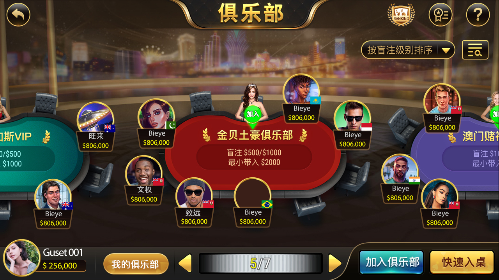
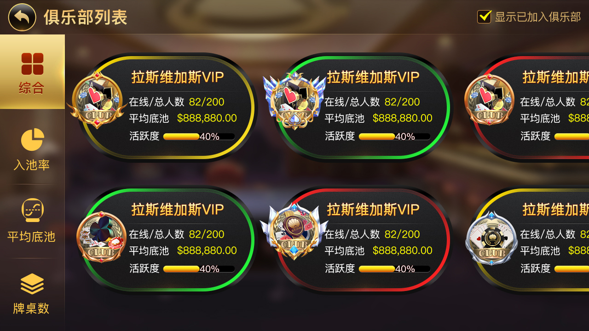
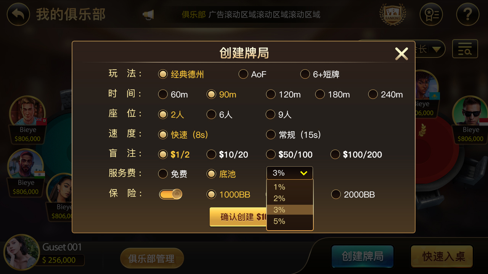

[简体中文](README.md) | [繁體中文](README.zh-TW.md) | [English](README.en.md)

# 德州扑克俱乐部源码（德州私人局） - C++/Tars 大厅、房间与会员服务

本仓库聚焦**德州扑克俱乐部源码**和大厅服务端组件。公开代码包括 C++/Tars Hall 与 GM 服务、房间及玩家生命周期、MySQL 数据访问、商城、签到、商品和服务费接口，以及部分 Unity 场景文件。

> 当前公开目录依赖外部 XGame/Tars 协议和运行环境，不是经过验证的一键部署完整客户端。功能、授权和商业交付范围必须以实际文件、书面清单和验收结果为准。

## 公开模块

| 模块 | 主要文件 | 可验证内容 |
| --- | --- | --- |
| 大厅服务 | `HallServer.*`、`HallServant.tars` | 大厅入口和服务接口 |
| GM 服务 | `GMServer.*`、`GMServantImp.h` | 管理服务入口和请求处理 |
| 房间流程 | `roomlogic/`、`timeoutlogic/` | 入桌、离桌、掉线、开局和超时流程 |
| 数据访问 | `DBOperator.*` | Tars MySQL 数据访问组件 |
| 商城与签到 | `MallProto.tars`、`GoodsManagerProto.tars`、`SignInProto.tars` | 商城、商品和签到协议 |
| Unity 场景 | `Production/*.unity` | 登录、大厅和牌桌场景文件；不代表完整 Unity 工程 |

## 适用方向

- 德州扑克俱乐部、会员和好友桌服务端研究
- C++/Tars 大厅、房间和玩家生命周期设计
- 商城、签到、服务费和用户信息协议参考
- 现有 XGame/Tars 环境中的二次开发评估

## ✨ 核心功能 | Core Features

| 模块 | 功能说明 |
| :--- | :--- |
| 🏆 **金币大厅** | 完整的经济系统，金币充值/消费/奖励 |
| 🎮 **多种玩法** | 经典德州 + 短牌 + SNG竞赛 |
| 🏅 **多锦标赛** | 多种德州锦标赛模式 |
| 👥 **社交系统** | 俱乐部 + 朋友局 |
| 🎁 **运营系统** | 签到、商城、道具系统 |

## 🎯 功能清单 | Feature List
✅ 金币大厅 ✅ 德州玩法 ✅ 短牌玩法
✅ SNG竞赛 ✅ 多锦标赛 ✅ 俱乐部系统
✅ 朋友局 ✅ 签到系统 ✅ 商城系统
✅ 道具系统 ✅ 充值系统 ✅ 战绩统计

## 🚀 技术架构 | Tech Stack

- **服务端**：C++ (稳定高效)
- **客户端**：Unity / Cocos (支持iOS/Android)
- **数据库**：MySQL + Redis
- **通信**：私有加密协议

## 产品界面

截图与公开代码共同展示俱乐部大厅、申请加入、会员管理和牌局设置。界面截图用于说明产品范围，不代表所有运行依赖已经包含在仓库内。

| 俱乐部大厅 | 俱乐部列表 |
| --- | --- |
|  |  |
| 会员管理 | 创建俱乐部牌局 |
|  |  |

更多实际界面：[简体中文项目页面](https://masterai-top.github.io/TexasHoldem-Club-Source/zh-cn/)。

## 相关项目

- [德州扑克源码完整解决方案](https://github.com/masterai-top/TexasHoldem-Poker-Complete-Solution)
- [德州扑克积分大厅源码](https://github.com/masterai-top/Texas-Hold-em-Points-Lobby)
- [德州扑克赛事平台源码](https://github.com/masterai-top/Texas-Holdem-Poker-Tournament-Event-Platform)
- [CFR 德州扑克 AI](https://github.com/masterai-top/cfr-poker-ai-masterai)

## 联系与合规

Telegram：`@xuzongbin001` · Email：`masterai918@gmail.com`

请遵守所在地法律、平台规则、隐私与未成年人保护要求。本仓库不鼓励或支持非法赌博用途。
