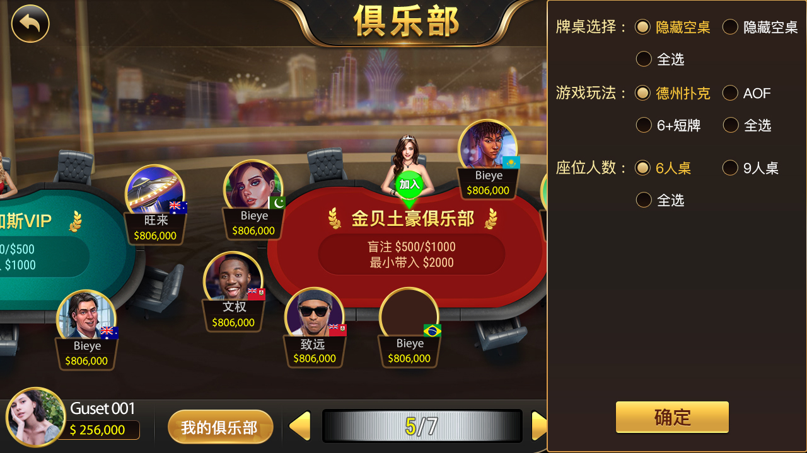
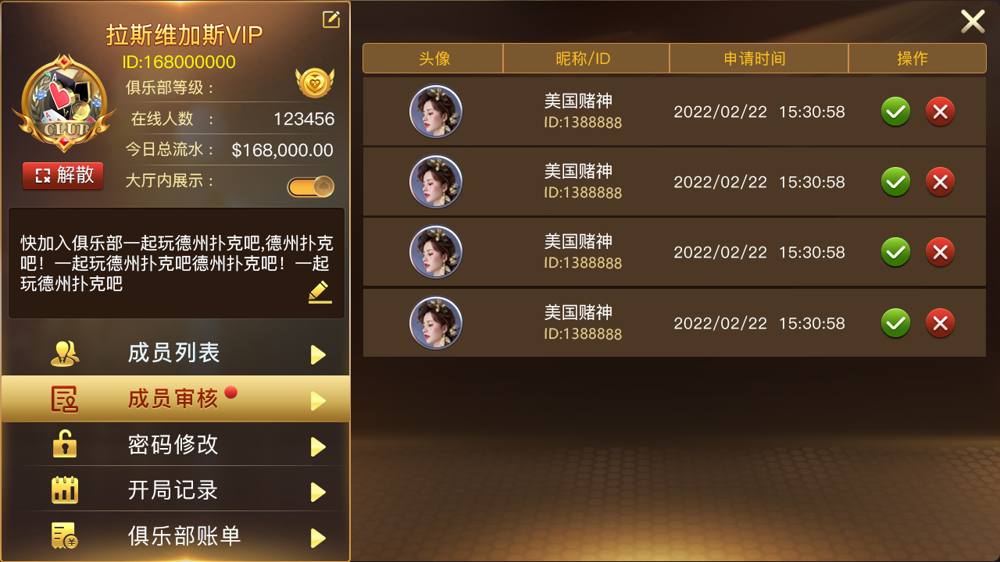
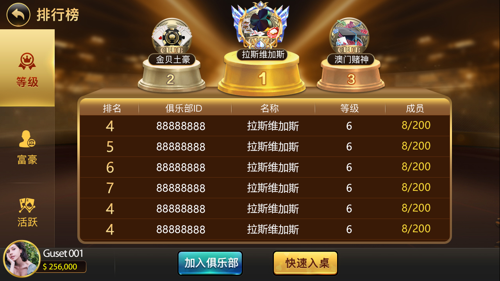

[简体中文](README.md) | [繁體中文](README.zh-TW.md) | [English](README.en.md)

# 德州撲克俱樂部原始碼：私人局、會員與牌桌大廳

面向德州撲克俱樂部、好友局與私人牌局情境的原始碼及產品介面參考。公開內容包含 C++/Tars Hall 與 GM 服務、房間和玩家生命週期、Tars MySQL 資料存取、商城/物品/簽到協定、服務費相關介面，以及部分 Unity 登入、大廳與牌桌場景。

> 範圍說明：本頁嚴格區分程式碼可驗證模組和截圖展示功能。專案仍依賴外部 XGame/Tars 協定與執行環境，不代表無需設定即可上線的完整商業客戶端。

## 產品流程

1. **探索俱樂部**：查看線上人數、總人數、平均底池與活躍度，依德州、AOF、6+ Short Deck、座位數及空滿桌篩選。
2. **建立或加入**：透過俱樂部 ID/名稱申請加入，也可建立自己的俱樂部；介面顯示最多加入 5 個俱樂部。
3. **會員管理**：查看成員及線上狀態，核准或拒絕加入申請，進入戰績與帳單入口。
4. **營運檢視**：依日/月查看俱樂部帳務與保險紀錄，透過等級、財富及活躍度排行榜觀察表現。
5. **建立牌桌**：設定德州、AOF 或 6+ Short Deck、60–240 分鐘、2/6/9 人、速度、盲注、服務費和保險選項。

## 真實產品介面

| 俱樂部大廳與牌桌 | 篩選與玩法 |
| --- | --- |
|  |  |
| 會員審核 | 建立私人牌桌 |
|  |  |
| 俱樂部帳單 | 俱樂部排行榜 |
|  |  |

[查看完整繁體中文產品頁](https://masterai-top.github.io/TexasHoldem-Club-Source/zh-tw/)

## 程式碼可驗證模組

| 模組 | 主要檔案 | 可驗證內容 |
| --- | --- | --- |
| 大廳與帳戶 | `HallServer.*`、`HallServant.tars` | 大廳入口、閘道狀態、使用者資料、財富/經驗、任務獎勵、系統訊息與郵件 |
| 房間流程 | `roomlogic/`、`timeoutlogic/` | 入桌、離桌、離線、開局、使用者映射與操作逾時 |
| GM 服務 | `GMServer.*`、`GMServantImp.h` | GM 服務入口與請求處理 |
| 資料存取 | `DBOperator.*` | Tars MySQL 資料存取元件 |
| 商城與物品 | `MallProto.tars`、`GoodsManagerProto.tars` | 平台/區域設定、購買、發放、使用、兌換與數量查詢 |
| 簽到獎勵 | `SignInProto.tars` | 簽到明細、累計簽到與新使用者獎勵介面 |
| 客戶端素材 | `Production/*.unity`、`apps.json` | 部分登入/大廳/牌桌場景及多平台版本設定；不是完整 Unity 專案 |

## 適合的二次開發方向

- 德州撲克俱樂部、好友局與私人牌局產品評估
- C++/Tars 大廳、房間、帳戶與逾時流程研究
- 會員審核、俱樂部帳單、排行榜和牌桌設定介面參考
- 商城、物品、簽到、郵件與服務費介面整合

## 聯絡方式

- Telegram：[@xuzongbin001](https://t.me/xuzongbin001)
- Email：[masterai918@gmail.com](mailto:masterai918@gmail.com)

請遵守所在地法律、平台規則、隱私與未成年人保護要求，不得用於非法賭博。

